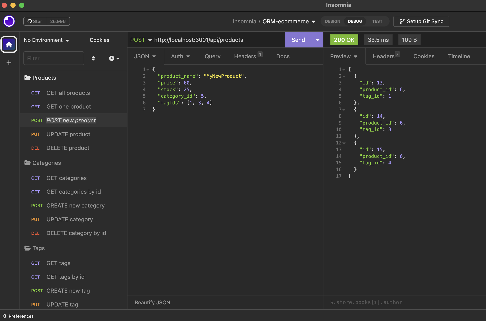

# wk13 - hanks-orm-e-commerce

## Description

The purpose of this project is to invoke Express, mySQL2, and sequelize packages in javascript to develop a functional backend for an e-commerce application.

- Insomnia is used to organize the GET, PUT, POST, DELETE routes for Tags, Categories, and Products.

- The package.json file includes a script to run the code automatically instead of using node server.js in conjunction with npm start, etc.

- The .env file is included in the .gitignore to protect my credentials. For those perusing this readme, make sure you create your own .env for database, user, password

## Installation

From the command line, run:

- npm init

- npm install mysql2

- npm install sequelize

- npm install express

- npm install dotenv

- npm run start

## Usage

Here's the [link to the video recording](https://drive.google.com/file/d/1YS9zWY12xCeA200d7lC3i5qsHxArSfCj/view?usp=sharing)

## Credits

Resources used:
1) Bootcamp Pre-work Modules in 13-ORM
2) Documentation linked in the homework activities

## License

Please refer to the LICENSE in the repository.
